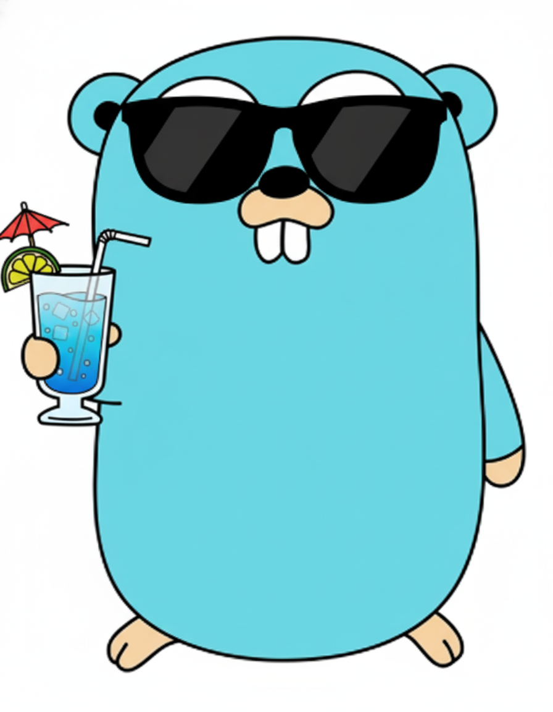

# Golang Drinks 🍹



Pequeno utilitário em **Go** que consome uma **API pública de drinks** e gera uma **planilha Excel** com os resultados.

É um projetinho pra demonstrar:

- Consumo de API REST (HTTP + JSON) em Go  
- Modelagem de structs pra mapear respostas JSON  
- Geração de arquivo **.xlsx** usando a lib `excelize`  

---

## 🧃 O que esse projeto faz?

1. Chama a API pública [TheCocktailDB](https://www.thecocktaildb.com/) usando a primeira letra dos drinks:

   ```text
   https://www.thecocktaildb.com/api/json/v1/1/search.php?f=a

📥 Instalação / Modo de usar

- go mod init github.com/fabyo/go-drinks
- go get github.com/xuri/excelize/v2
- go mod tidy
